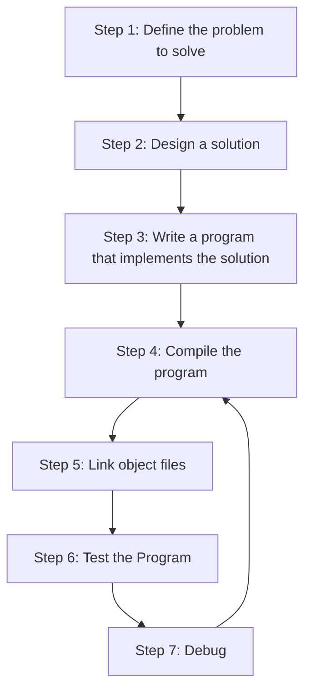
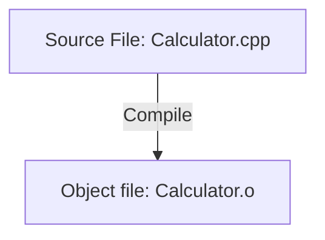

# learningcpp




### Compiling source files
> C++ compiler goes through each source code file in the program and does 2 things:
1. makes sure the files follow C++ rules.
2. translates c++ code into machine language intstructions which are stored in **object file** (something.o).



### linking object files and libraries

> combines all the object files to produce the output file (executable file).

1. reads all the object files to make sure they are valid
2. resolves all cross-file dependencies.
3. linkes libraries

```mermaid
  A[Object file: Calculator.o] --> B{Linker}
  C[Object file: Fraction.o] --> B
  D[Object file: Math.o] --> B
  


```
