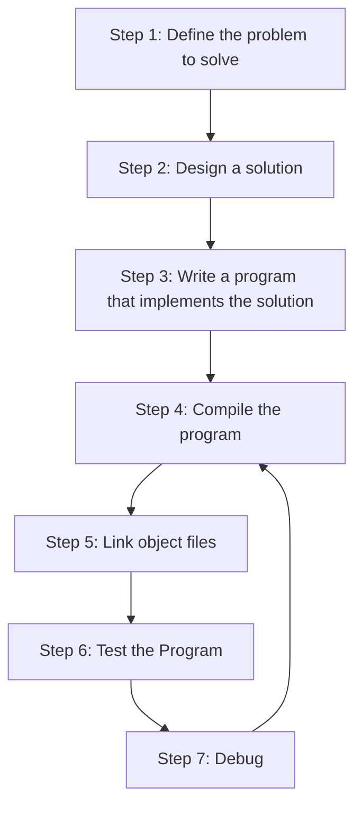

# learningcpp
exercises + notes from the learningcpp course

```mermaid
flowchart TD
  A[Step 1: Define the problem to solve] --> B[Step 2: Design a solution]
  B --> C[Step 3: Write a program that implements the solution]
  C --> D[Step 4: Compile the program]
  D --> E[Step 5: Link object files]
  E --> F[Step 6: Test the Program]
  F --> G[Step 7: Debug] --> D


```
